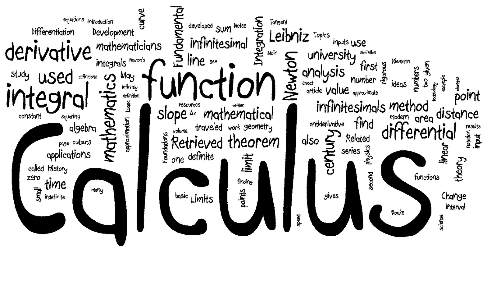

# Brandon Rogers Info Page

### Table of Contents
[Work](#work)
[Projects](#projects)
[School](#school)
[Free Time](#free-time)

## Work

> Aqua SD


I currently work at **Aqua SD** writing software, managing their website, and posting to their social media. I joined them at the end of february and in that short time I have automated the posting of over 3000 products. In addition, I have worked to model consumer trends in order to sell **More** Products at **Better** margins.

Tasks:
- [x] Autopost to eBay
- [x] Autopost to Retail
- [x] Pull items from website
- [ ] Automatically add to clearance
- [ ] Automatically recycle photos

> Tutoring



I also am a part time tutor for calculus and the SAT in my free time. I am able to manage around 5 hours of tutoring a week in addition to my heavy workload from school and my job.

## Projects

> Wordle

My first ever project was in high school when I made a wordle solver. It used info fed to it by the user to assist them by giving them all possible words it could be, along with some words deemed to be the most "best" guesses. Code publicly available in my [WordleSolver repo](https://github.com/bmrogers2022/PythonProjects/tree/main/WordleSolver).

> Autodraft

One of my more recent projects was an autodrafter for fantasy football. On the first use it successfully drafted the highest scoring team in my league by drafting based on a set preference order rather than on ADP alone. In the future, I plan to use projected points and tensorflow in order to make a smarter and more adaptable system, as well as prevent drafting too much of the same position. Code publicly available in my [AutoDraft repo](https://github.com/bmrogers2022/PythonProjects/tree/main/NFL_code/AutoDraft)

TODO:
- [ ] Prevent drafting too much of same position
- [ ] Tensorflow to combine projected points and amount of positions available to judge value based on league settings

## School

I am making this page for my CSE 110 class as a part of our first lab. I had to create this page on top of the repo, as well as post screenshots [here](screenshots).

## Free Time


In my free time, some things I enjoy doing include (in order): 

1. Tennis
2. Soccer
3. Football
4. Chess
5. Any Board Game

What I anjoy about these activities the most is the opportunity to interact with my friends as they are all activities you do with other people. My favorite board games other than Chess are as follows: 

* Splendor
* Sequence
* Exploding Kittens
* Toss The Burrito
* How To Rob A Bank

```
return 0;
```